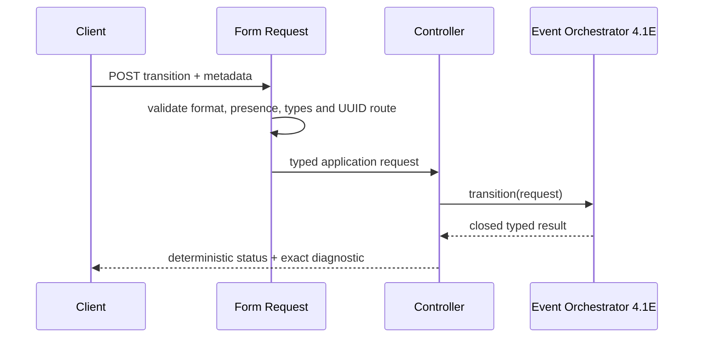

# Listing Publication HTTP Runtime Sequence

```mermaid
sequenceDiagram
    participant Client
    participant Request as Form Request
    participant Controller
    participant Orchestrator as Event Orchestrator 4.1E

    Client->>Request: POST transition + metadata
    Request->>Request: validate format, presence, types and UUID route
    Request->>Controller: typed application request
    Controller->>Orchestrator: transition(request)
    Orchestrator-->>Controller: closed typed result
    Controller-->>Client: deterministic status + exact diagnostic
```

Toute requête invalide s'arrête avant l'appel à l'orchestrateur. Les décisions, écritures et événements restent intégralement derrière le port 4.1E.
