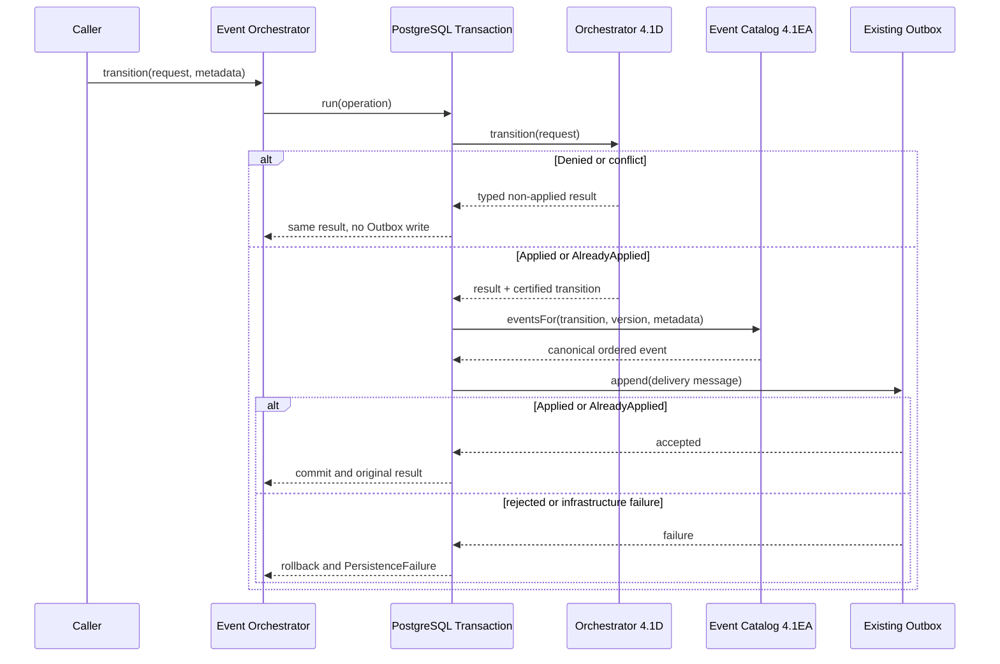

# Listing Publication Workflow Event Sequence

Le Worker et le routeur sont volontairement absents de cette transaction : ils reprennent ultérieurement le message durable selon leurs contrats certifiés.
