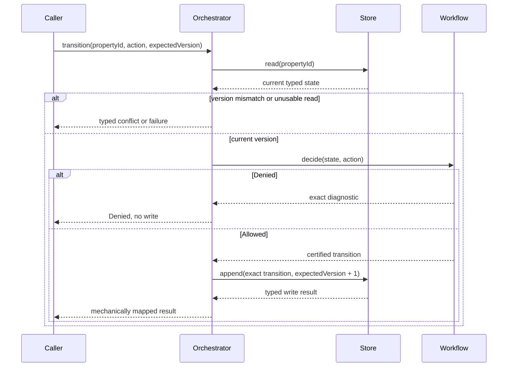

# Property Lifecycle Runtime Sequence

```mermaid
sequenceDiagram
    participant Caller
    participant Orchestrator
    participant Store
    participant Workflow

    Caller->>Orchestrator: transition(propertyId, action, expectedVersion)
    Orchestrator->>Store: read(propertyId)
    Store-->>Orchestrator: current typed state
    alt version mismatch or unusable read
        Orchestrator-->>Caller: typed conflict or failure
    else current version
        Orchestrator->>Workflow: decide(state, action)
        alt Denied
            Workflow-->>Orchestrator: exact diagnostic
            Orchestrator-->>Caller: Denied, no write
        else Allowed
            Workflow-->>Orchestrator: certified transition
            Orchestrator->>Store: append(exact transition, expectedVersion + 1)
            Store-->>Orchestrator: typed write result
            Orchestrator-->>Caller: mechanically mapped result
        end
    end
```
