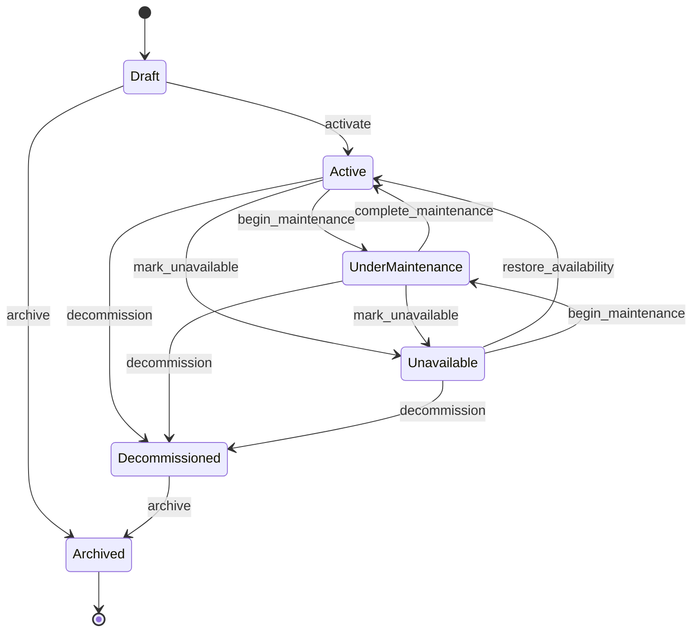

# Property Lifecycle State Machine Specification

La machine comporte six états, huit actions dont `Unknown`, et douze transitions autorisées. `Archived` est terminal. `Decommissioned` n'autorise plus que l'archivage.

Toute paire absente est refusée explicitement. Aucune branche par défaut n'existe.
